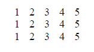
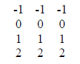
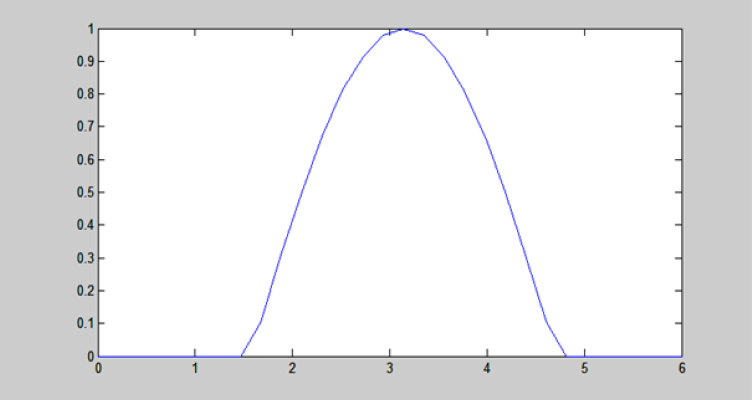
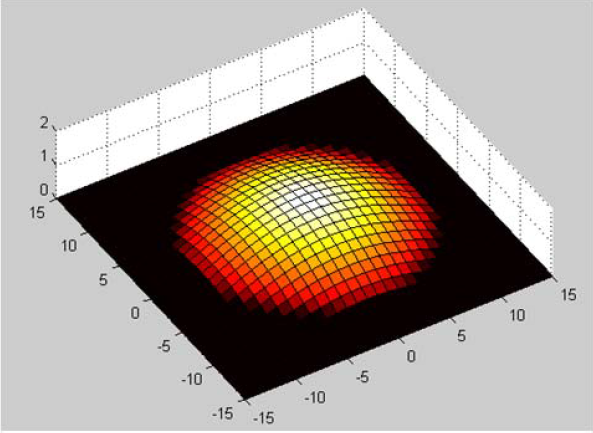
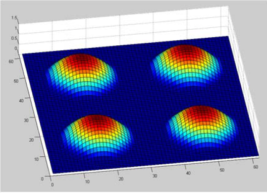

# Sessió 1 de Laboratori

### Nota: 9.0

## Continguts de la sessió

L’objectiu de la sessió és el de familiaritzar-se amb les funcions bàsiques de Matlab. En concret es treballaran els següents aspectes:

* Creació de vectors i matrius. Operacions elementals entre vectors.
* Concatenació de vectors i accés als elements.
* Funcions bàsiques: max/min/sum.
* Creació de funcions i comandes relacionades: fplot, fminsearch.
* Creació d’scripts.
* Plots: cloud points, surface i countour plot.

## Exercicis de la sessió

Una vegada realitzada la sessió de laboratori caldrà dur a terme els següents exercicis i **entregar-los al racó en un informe en format pdf** abans de la següent sessió.

Podeu trobar l'execució de tots els exercicis al fitxer _main.mlx_ (fitxer LiveScript de MatLab)

1. Trobeu unes expressions en llenguatge Matlab que al multiplicar dos vectors s’obtindrien les següents matrius:

	1. 
	

	2. 
	

2. Realitzar un plot amb l’aspecte de la figura següent. La dimensió dels vectors que contenen els valors de l’eix horitzontal i vertical (x,y) hauran de ser de 30 elements.

3. Realitzar un plot amb l’aspecte de la figura següent.

4. Realitzar un plot amb l’aspecte de la figura següent sense redefinir les funcions matemàtiques utilitzades en l’exercici anterior. Només es podran utilitzar comandes de creació i concatenació de matrius.

5. Cercar el mínim aproximat de la següent funció.

`f(x, y) = (x^2+ y - 5)^2 + (x + y^2 - 9)^2`
