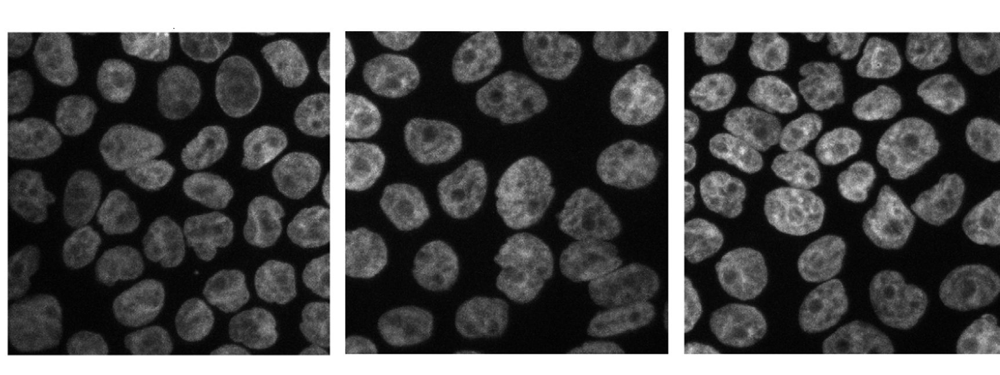

# Sessió 7 de Laboratori

### Nota: 8.5

## Enunciat de la sessió

Per aquesta practica s'ens demana que a partir de la imatge:

arribar a la imatge:

mitjançant morfologisme i binarització, per tal d'arribar a poder utilitzar els millors métodes, tenim l'explicació de com utilitzar-los al fitxer _Explicacions.mlx_ (fitxer LiveScript de MatLab). 

**Podeu trobar la solució del problema al fitxer _Entrega.mlx_ (fitxer LiveScript de MatLab)**

**Les imatges utilitzades durant aquesta practica ha estat les imatges _cellsegmentationcompetition.png_, i _cellsegmentationcompetitionresult.png_ que es troben a la carpeta data de la sessió.**